```mermaid
graph TB
    subgraph "Angular Frontend"
        subgraph "UI Components"
            A1[App Component]
            A2[Navigation/Sidebar]
            A3[Dashboard]
            A4[Products Module]
            A5[Inventory Module]
            A6[Reports Module]
            A7[User Management]
            A8[Authentication UI]
        end
        
        subgraph "Services"
            B1[Auth Service]
            B2[HTTP Interceptor]
            B3[Product Service]
            B4[Inventory Service]
            B5[Reports Service]
            B6[User Service]
        end
        
        subgraph "State Management"
            C1[NgRx Store]
            C2[Actions]
            C3[Reducers]
            C4[Effects]
            C5[Selectors]
        end
        
        subgraph "Core"
            D1[Guards]
            D2[Models/Interfaces]
            D3[Shared Components]
            D4[Utilities]
        end
        
        A1 --> A2
        A1 --> A3
        A1 --> A4
        A1 --> A5
        A1 --> A6
        A1 --> A7
        A1 --> A8
        
        A3 --> B3
        A3 --> B4
        A3 --> B5
        A4 --> B3
        A5 --> B4
        A6 --> B5
        A7 --> B6
        A8 --> B1
        
        B1 --> C1
        B2 --> B1
        B3 --> C1
        B4 --> C1
        B5 --> C1
        B6 --> C1
        
        C1 --> C2
        C2 --> C3
        C3 --> C1
        C2 --> C4
        C4 --> C1
        C1 --> C5
        
        D1 --> B1
        A1 --> D3
        B1 --> D2
        B3 --> D2
        B4 --> D2
        B5 --> D2
        B6 --> D2
    end
    
    subgraph "Backend (Node.js/Express)"
        subgraph "API Routes"
            E1[Auth Routes]
            E2[Product Routes]
            E3[Inventory Routes]
            E4[Reports Routes]
            E5[User Routes]
        end
        
        subgraph "Middleware"
            F1[Auth Middleware]
            F2[Error Handler]
            F3[Request Validator]
            F4[CORS Handler]
            F5[Logger]
        end
        
        subgraph "Controllers"
            G1[Auth Controller]
            G2[Product Controller]
            G3[Inventory Controller]
            G4[Reports Controller]
            G5[User Controller]
        end
        
        subgraph "Services"
            H1[Auth Service]
            H2[Product Service]
            H3[Inventory Service]
            H4[Reports Service]
            H5[User Service]
        end
        
        subgraph "Data Access"
            I1[DynamoDB Client]
            I2[Data Mappers]
            I3[Query Builders]
        end
        
        E1 --> F1
        E2 --> F1
        E3 --> F1
        E4 --> F1
        E5 --> F1
        
        E1 --> G1
        E2 --> G2
        E3 --> G3
        E4 --> G4
        E5 --> G5
        
        G1 --> H1
        G2 --> H2
        G3 --> H3
        G4 --> H4
        G5 --> H5
        
        H1 --> I1
        H2 --> I1
        H3 --> I1
        H4 --> I1
        H5 --> I1
        
        I1 --> I2
        I1 --> I3
    end
    
    subgraph "AWS DynamoDB"
        J1[Users Table]
        J2[Products Table]
        J3[Inventory Table]
        J4[Sales Table]
        J5[Reports Table]
    end
    
    I1 --> J1
    I1 --> J2
    I1 --> J3
    I1 --> J4
    I1 --> J5
    
    B1 --> E1
    B3 --> E2
    B4 --> E3
    B5 --> E4
    B6 --> E5
    
    style A1 fill:#DD0031,stroke:#333,stroke-width:1px,color:white
    style A2 fill:#DD0031,stroke:#333,stroke-width:1px,color:white
    style A3 fill:#DD0031,stroke:#333,stroke-width:1px,color:white
    style A4 fill:#DD0031,stroke:#333,stroke-width:1px,color:white
    style A5 fill:#DD0031,stroke:#333,stroke-width:1px,color:white
    style A6 fill:#DD0031,stroke:#333,stroke-width:1px,color:white
    style A7 fill:#DD0031,stroke:#333,stroke-width:1px,color:white
    style A8 fill:#DD0031,stroke:#333,stroke-width:1px,color:white
    
    style B1 fill:#DD0031,stroke:#333,stroke-width:1px,color:white
    style B2 fill:#DD0031,stroke:#333,stroke-width:1px,color:white
    style B3 fill:#DD0031,stroke:#333,stroke-width:1px,color:white
    style B4 fill:#DD0031,stroke:#333,stroke-width:1px,color:white
    style B5 fill:#DD0031,stroke:#333,stroke-width:1px,color:white
    style B6 fill:#DD0031,stroke:#333,stroke-width:1px,color:white
    
    style C1 fill:#DD0031,stroke:#333,stroke-width:1px,color:white
    style C2 fill:#DD0031,stroke:#333,stroke-width:1px,color:white
    style C3 fill:#DD0031,stroke:#333,stroke-width:1px,color:white
    style C4 fill:#DD0031,stroke:#333,stroke-width:1px,color:white
    style C5 fill:#DD0031,stroke:#333,stroke-width:1px,color:white
    
    style D1 fill:#DD0031,stroke:#333,stroke-width:1px,color:white
    style D2 fill:#DD0031,stroke:#333,stroke-width:1px,color:white
    style D3 fill:#DD0031,stroke:#333,stroke-width:1px,color:white
    style D4 fill:#DD0031,stroke:#333,stroke-width:1px,color:white
    
    style E1 fill:#68BD45,stroke:#333,stroke-width:1px
    style E2 fill:#68BD45,stroke:#333,stroke-width:1px
    style E3 fill:#68BD45,stroke:#333,stroke-width:1px
    style E4 fill:#68BD45,stroke:#333,stroke-width:1px
    style E5 fill:#68BD45,stroke:#333,stroke-width:1px
    
    style F1 fill:#68BD45,stroke:#333,stroke-width:1px
    style F2 fill:#68BD45,stroke:#333,stroke-width:1px
    style F3 fill:#68BD45,stroke:#333,stroke-width:1px
    style F4 fill:#68BD45,stroke:#333,stroke-width:1px
    style F5 fill:#68BD45,stroke:#333,stroke-width:1px
    
    style G1 fill:#68BD45,stroke:#333,stroke-width:1px
    style G2 fill:#68BD45,stroke:#333,stroke-width:1px
    style G3 fill:#68BD45,stroke:#333,stroke-width:1px
    style G4 fill:#68BD45,stroke:#333,stroke-width:1px
    style G5 fill:#68BD45,stroke:#333,stroke-width:1px
    
    style H1 fill:#68BD45,stroke:#333,stroke-width:1px
    style H2 fill:#68BD45,stroke:#333,stroke-width:1px
    style H3 fill:#68BD45,stroke:#333,stroke-width:1px
    style H4 fill:#68BD45,stroke:#333,stroke-width:1px
    style H5 fill:#68BD45,stroke:#333,stroke-width:1px
    
    style I1 fill:#68BD45,stroke:#333,stroke-width:1px
    style I2 fill:#68BD45,stroke:#333,stroke-width:1px
    style I3 fill:#68BD45,stroke:#333,stroke-width:1px
    
    style J1 fill:#FF9900,stroke:#333,stroke-width:1px
    style J2 fill:#FF9900,stroke:#333,stroke-width:1px
    style J3 fill:#FF9900,stroke:#333,stroke-width:1px
    style J4 fill:#FF9900,stroke:#333,stroke-width:1px
    style J5 fill:#FF9900,stroke:#333,stroke-width:1px
```

# Component Diagram

This diagram breaks down the application into its key components, showing the relationships between different parts of the system.

## Angular Frontend

### UI Components
- **App Component**: The root component that hosts all other components
- **Navigation/Sidebar**: Provides navigation throughout the application
- **Dashboard**: Displays summary information and key metrics
- **Products Module**: Manages product catalog and categories
- **Inventory Module**: Handles stock levels and inventory management
- **Reports Module**: Generates sales and inventory reports
- **User Management**: Administers user accounts and permissions
- **Authentication UI**: Login, registration, and password recovery screens

### Services
- **Auth Service**: Manages authentication state and tokens
- **HTTP Interceptor**: Adds authentication headers to API requests
- **Product Service**: Handles product-related API calls
- **Inventory Service**: Manages inventory-related operations
- **Reports Service**: Generates and retrieves reports
- **User Service**: Handles user management operations

### State Management (NgRx)
- **Store**: Central state container
- **Actions**: Events that trigger state changes
- **Reducers**: Pure functions that update state
- **Effects**: Handle side effects like API calls
- **Selectors**: Extract specific pieces of state

### Core
- **Guards**: Protect routes based on authentication/authorization
- **Models/Interfaces**: TypeScript interfaces for data structures
- **Shared Components**: Reusable UI components
- **Utilities**: Helper functions and common utilities

## Backend (Node.js/Express)

### API Routes
- **Auth Routes**: Authentication endpoints
- **Product Routes**: Product management endpoints
- **Inventory Routes**: Inventory management endpoints
- **Reports Routes**: Reporting endpoints
- **User Routes**: User management endpoints

### Middleware
- **Auth Middleware**: Validates JWT tokens
- **Error Handler**: Processes and formats error responses
- **Request Validator**: Validates incoming request data
- **CORS Handler**: Manages cross-origin requests
- **Logger**: Records API activity

### Controllers
- **Auth Controller**: Handles authentication logic
- **Product Controller**: Manages product operations
- **Inventory Controller**: Handles inventory operations
- **Reports Controller**: Generates reports
- **User Controller**: Manages user operations

### Services
- **Auth Service**: Implements authentication business logic
- **Product Service**: Implements product business logic
- **Inventory Service**: Implements inventory business logic
- **Reports Service**: Implements reporting business logic
- **User Service**: Implements user management business logic

### Data Access
- **DynamoDB Client**: Interfaces with AWS DynamoDB
- **Data Mappers**: Transforms between application and database models
- **Query Builders**: Constructs DynamoDB queries

## AWS DynamoDB
- **Users Table**: Stores user information
- **Products Table**: Stores product catalog
- **Inventory Table**: Tracks inventory levels
- **Sales Table**: Records sales transactions
- **Reports Table**: Stores generated reports
