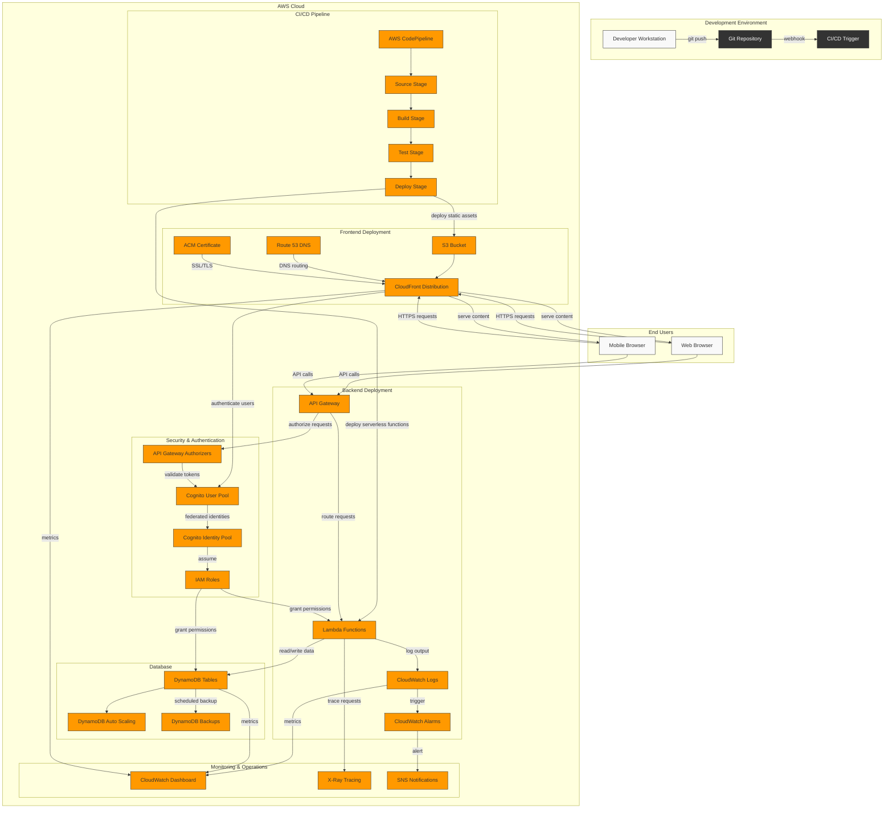

# Deployment Diagram

This diagram illustrates the AWS serverless deployment setup for our application, showing how all components are deployed and interact in the cloud environment.

## Development Environment
- **Developer Workstation**: Local development environment
- **Git Repository**: Source code version control (GitHub, GitLab, etc.)
- **CI/CD Trigger**: Webhook that initiates the deployment pipeline

## AWS Cloud Infrastructure

### CI/CD Pipeline
- **AWS CodePipeline**: Orchestrates the deployment workflow
- **Source Stage**: Pulls code from the repository
- **Build Stage**: Compiles and bundles the application
- **Test Stage**: Runs automated tests
- **Deploy Stage**: Deploys to production environment

### Frontend Deployment
- **S3 Bucket**: Hosts static Angular assets
- **CloudFront Distribution**: CDN for global content delivery
- **Route 53 DNS**: Domain name management
- **ACM Certificate**: SSL/TLS certificate for HTTPS

### Backend Deployment
- **API Gateway**: RESTful API endpoint management
- **Lambda Functions**: Serverless compute for Express.js API
- **CloudWatch Logs**: Captures application logs
- **CloudWatch Alarms**: Monitors for issues and anomalies

### Database
- **DynamoDB Tables**: NoSQL data storage
- **DynamoDB Auto Scaling**: Automatic capacity adjustment
- **DynamoDB Backups**: Point-in-time recovery

### Security & Authentication
- **Cognito User Pool**: User directory and authentication
- **Cognito Identity Pool**: Federated identity management
- **IAM Roles**: Fine-grained access control
- **API Gateway Authorizers**: JWT token validation

### Monitoring & Operations
- **CloudWatch Dashboard**: Centralized monitoring
- **X-Ray Tracing**: Request tracing and performance analysis
- **SNS Notifications**: Alerts and notifications

## End Users
- **Web Browser**: Desktop access
- **Mobile Browser**: Mobile access

This serverless architecture provides several benefits:
1. **Scalability**: Automatic scaling based on demand
2. **Cost-Efficiency**: Pay only for resources used
3. **Reliability**: High availability across multiple AWS availability zones
4. **Security**: Comprehensive security controls at multiple levels
5. **DevOps Integration**: Streamlined CI/CD pipeline
6. **Reduced Operational Overhead**: No server management required
