```mermaid
graph TB
    subgraph "User Interaction"
        A1[User Browser] --> A2[Angular App]
    end

    subgraph "Angular Core"
        B1[App Module]
        B2[App Component]
        B3[App Routing Module]
        B4[Shared Module]
        
        B1 --> B2
        B1 --> B3
        B1 --> B4
    end
    
    subgraph "Authentication Flow"
        C1[Login Component]
        C2[Register Component]
        C3[Auth Guard]
        C4[JWT Interceptor]
        C5[Auth Service]
        C6[Token Storage]
        
        C1 --> C5
        C2 --> C5
        C5 --> C6
        C3 --> C5
        C4 --> C5
        C4 --> C6
    end
    
    subgraph "Core Components"
        D1[Sidebar Component]
        D2[Header Component]
        D3[Footer Component]
        D4[Dashboard Component]
        
        B2 --> D1
        B2 --> D2
        B2 --> D3
        D1 --> D4
    end
    
    subgraph "Feature Modules"
        E1[Products Module]
        E2[Inventory Module]
        E3[Sales Module]
        E4[Reports Module]
        E5[User Management Module]
        
        B3 --> E1
        B3 --> E2
        B3 --> E3
        B3 --> E4
        B3 --> E5
    end
    
    subgraph "Products Feature"
        F1[Product List Component]
        F2[Product Detail Component]
        F3[Product Form Component]
        F4[Category List Component]
        F5[Product Service]
        F6[Category Service]
        
        E1 --> F1
        E1 --> F2
        E1 --> F3
        E1 --> F4
        F1 --> F5
        F2 --> F5
        F3 --> F5
        F4 --> F6
    end
    
    subgraph "Inventory Feature"
        G1[Stock Levels Component]
        G2[Stock Adjustment Component]
        G3[Inventory Service]
        
        E2 --> G1
        E2 --> G2
        G1 --> G3
        G2 --> G3
    end
    
    subgraph "Sales Feature"
        H1[Sales List Component]
        H2[New Sale Component]
        H3[Returns Component]
        H4[Sales Service]
        
        E3 --> H1
        E3 --> H2
        E3 --> H3
        H1 --> H4
        H2 --> H4
        H3 --> H4
    end
    
    subgraph "Reports Feature"
        I1[Reports Component]
        I2[Sales Reports Component]
        I3[Inventory Reports Component]
        I4[Reports Service]
        
        E4 --> I1
        I1 --> I2
        I1 --> I3
        I2 --> I4
        I3 --> I4
    end
    
    subgraph "User Management Feature"
        J1[User List Component]
        J2[User Form Component]
        J3[User Service]
        
        E5 --> J1
        E5 --> J2
        J1 --> J3
        J2 --> J3
    end
    
    subgraph "State Management"
        K1[Store]
        K2[Actions]
        K3[Reducers]
        K4[Effects]
        K5[Selectors]
        
        K2 --> K3
        K3 --> K1
        K4 --> K1
        K1 --> K5
    end
    
    subgraph "HTTP Communication"
        L1[HTTP Client]
        L2[API Service]
        L3[Error Handler]
        
        L1 --> L2
        L1 --> L3
        C4 --> L1
    end
    
    subgraph "Form Handling"
        M1[Reactive Forms]
        M2[Form Validation]
        M3[Form Controls]
        
        M1 --> M2
        M1 --> M3
        F3 --> M1
        G2 --> M1
        H2 --> M1
        J2 --> M1
    end
    
    subgraph "Data Flow"
        N1[User Input]
        N2[Component Logic]
        N3[Service Call]
        N4[HTTP Request]
        N5[API Response]
        N6[State Update]
        N7[UI Update]
        
        N1 --> N2
        N2 --> N3
        N3 --> N4
        N4 --> N5
        N5 --> N6
        N6 --> N7
    end
    
    %% Connect Features to Services
    F5 --> L2
    F6 --> L2
    G3 --> L2
    H4 --> L2
    I4 --> L2
    J3 --> L2
    
    %% Connect Features to State Management
    F5 --> K2
    F6 --> K2
    G3 --> K2
    H4 --> K2
    I4 --> K2
    J3 --> K2
    
    %% Connect Components to State
    F1 --> K5
    F2 --> K5
    F3 --> K5
    F4 --> K5
    G1 --> K5
    G2 --> K5
    H1 --> K5
    H2 --> K5
    H3 --> K5
    I2 --> K5
    I3 --> K5
    J1 --> K5
    J2 --> K5
    
    %% Connect User Interaction to App
    A2 --> B1
    
    style A1 fill:#f9f9f9,stroke:#333,stroke-width:1px
    style A2 fill:#DD0031,stroke:#333,stroke-width:1px,color:white
    
    style B1 fill:#DD0031,stroke:#333,stroke-width:1px,color:white
    style B2 fill:#DD0031,stroke:#333,stroke-width:1px,color:white
    style B3 fill:#DD0031,stroke:#333,stroke-width:1px,color:white
    style B4 fill:#DD0031,stroke:#333,stroke-width:1px,color:white
    
    style C1 fill:#DD0031,stroke:#333,stroke-width:1px,color:white
    style C2 fill:#DD0031,stroke:#333,stroke-width:1px,color:white
    style C3 fill:#DD0031,stroke:#333,stroke-width:1px,color:white
    style C4 fill:#DD0031,stroke:#333,stroke-width:1px,color:white
    style C5 fill:#DD0031,stroke:#333,stroke-width:1px,color:white
    style C6 fill:#DD0031,stroke:#333,stroke-width:1px,color:white
    
    style D1 fill:#DD0031,stroke:#333,stroke-width:1px,color:white
    style D2 fill:#DD0031,stroke:#333,stroke-width:1px,color:white
    style D3 fill:#DD0031,stroke:#333,stroke-width:1px,color:white
    style D4 fill:#DD0031,stroke:#333,stroke-width:1px,color:white
    
    style E1 fill:#DD0031,stroke:#333,stroke-width:1px,color:white
    style E2 fill:#DD0031,stroke:#333,stroke-width:1px,color:white
    style E3 fill:#DD0031,stroke:#333,stroke-width:1px,color:white
    style E4 fill:#DD0031,stroke:#333,stroke-width:1px,color:white
    style E5 fill:#DD0031,stroke:#333,stroke-width:1px,color:white
    
    style F1 fill:#DD0031,stroke:#333,stroke-width:1px,color:white
    style F2 fill:#DD0031,stroke:#333,stroke-width:1px,color:white
    style F3 fill:#DD0031,stroke:#333,stroke-width:1px,color:white
    style F4 fill:#DD0031,stroke:#333,stroke-width:1px,color:white
    style F5 fill:#DD0031,stroke:#333,stroke-width:1px,color:white
    style F6 fill:#DD0031,stroke:#333,stroke-width:1px,color:white
    
    style G1 fill:#DD0031,stroke:#333,stroke-width:1px,color:white
    style G2 fill:#DD0031,stroke:#333,stroke-width:1px,color:white
    style G3 fill:#DD0031,stroke:#333,stroke-width:1px,color:white
    
    style H1 fill:#DD0031,stroke:#333,stroke-width:1px,color:white
    style H2 fill:#DD0031,stroke:#333,stroke-width:1px,color:white
    style H3 fill:#DD0031,stroke:#333,stroke-width:1px,color:white
    style H4 fill:#DD0031,stroke:#333,stroke-width:1px,color:white
    
    style I1 fill:#DD0031,stroke:#333,stroke-width:1px,color:white
    style I2 fill:#DD0031,stroke:#333,stroke-width:1px,color:white
    style I3 fill:#DD0031,stroke:#333,stroke-width:1px,color:white
    style I4 fill:#DD0031,stroke:#333,stroke-width:1px,color:white
    
    style J1 fill:#DD0031,stroke:#333,stroke-width:1px,color:white
    style J2 fill:#DD0031,stroke:#333,stroke-width:1px,color:white
    style J3 fill:#DD0031,stroke:#333,stroke-width:1px,color:white
    
    style K1 fill:#DD0031,stroke:#333,stroke-width:1px,color:white
    style K2 fill:#DD0031,stroke:#333,stroke-width:1px,color:white
    style K3 fill:#DD0031,stroke:#333,stroke-width:1px,color:white
    style K4 fill:#DD0031,stroke:#333,stroke-width:1px,color:white
    style K5 fill:#DD0031,stroke:#333,stroke-width:1px,color:white
    
    style L1 fill:#DD0031,stroke:#333,stroke-width:1px,color:white
    style L2 fill:#DD0031,stroke:#333,stroke-width:1px,color:white
    style L3 fill:#DD0031,stroke:#333,stroke-width:1px,color:white
    
    style M1 fill:#DD0031,stroke:#333,stroke-width:1px,color:white
    style M2 fill:#DD0031,stroke:#333,stroke-width:1px,color:white
    style M3 fill:#DD0031,stroke:#333,stroke-width:1px,color:white
    
    style N1 fill:#6495ED,stroke:#333,stroke-width:1px
    style N2 fill:#6495ED,stroke:#333,stroke-width:1px
    style N3 fill:#6495ED,stroke:#333,stroke-width:1px
    style N4 fill:#6495ED,stroke:#333,stroke-width:1px
    style N5 fill:#6495ED,stroke:#333,stroke-width:1px
    style N6 fill:#6495ED,stroke:#333,stroke-width:1px
    style N7 fill:#6495ED,stroke:#333,stroke-width:1px
```

# Detailed Frontend Architecture and Data Flow

This diagram provides a comprehensive view of the Angular frontend architecture for the Baby Clothing Store Management System, including component relationships, data flow, and user interactions.

## 1. User Interaction

- **User Browser**: The entry point where users access the application
- **Angular App**: The main application that loads in the browser

## 2. Angular Core

- **App Module**: The root module that bootstraps the application
- **App Component**: The root component that hosts all other components
- **App Routing Module**: Manages navigation between different views
- **Shared Module**: Contains reusable components, directives, and pipes

## 3. Authentication Flow

- **Login Component**: Handles user login
- **Register Component**: Manages new user registration
- **Auth Guard**: Protects routes based on authentication status
- **JWT Interceptor**: Adds authentication tokens to HTTP requests
- **Auth Service**: Manages authentication logic
- **Token Storage**: Stores authentication tokens (localStorage/sessionStorage)

## 4. Core Components

- **Sidebar Component**: Navigation menu for the application
- **Header Component**: Top navigation bar
- **Footer Component**: Application footer
- **Dashboard Component**: Main landing page after login

## 5. Feature Modules

The application is organized into feature modules, each handling a specific business domain:

### Products Feature

- **Product List Component**: Displays all products with filtering and sorting
- **Product Detail Component**: Shows detailed information for a single product
- **Product Form Component**: Handles creating and editing products
- **Category List Component**: Manages product categories
- **Product Service**: Handles product-related API calls
- **Category Service**: Manages category-related API calls

### Inventory Feature

- **Stock Levels Component**: Shows current inventory levels
- **Stock Adjustment Component**: Handles inventory adjustments
- **Inventory Service**: Manages inventory-related API calls

### Sales Feature

- **Sales List Component**: Displays sales history
- **New Sale Component**: Processes new sales
- **Returns Component**: Handles product returns
- **Sales Service**: Manages sales-related API calls

### Reports Feature

- **Reports Component**: Main reports dashboard
- **Sales Reports Component**: Generates sales reports
- **Inventory Reports Component**: Generates inventory reports
- **Reports Service**: Handles report-related API calls

### User Management Feature

- **User List Component**: Displays all users
- **User Form Component**: Handles creating and editing users
- **User Service**: Manages user-related API calls

## 6. State Management (NgRx)

- **Store**: Central state container
- **Actions**: Events that trigger state changes
- **Reducers**: Pure functions that update state
- **Effects**: Handle side effects like API calls
- **Selectors**: Extract specific pieces of state

## 7. HTTP Communication

- **HTTP Client**: Angular's built-in HTTP client
- **API Service**: Base service for API communication
- **Error Handler**: Centralized error handling

## 8. Form Handling

- **Reactive Forms**: Angular's reactive forms approach
- **Form Validation**: Validation rules and error messages
- **Form Controls**: Individual form controls and groups

## 9. Data Flow

The typical data flow in the application follows this pattern:

1. **User Input**: User interacts with the UI (clicks, form inputs)
2. **Component Logic**: Component processes the input
3. **Service Call**: Component calls a service method
4. **HTTP Request**: Service makes an API request
5. **API Response**: Backend responds with data
6. **State Update**: Application state is updated (via NgRx or service)
7. **UI Update**: UI reflects the updated state

## Key User Journeys

### Product Management Journey

1. User navigates to Products via Sidebar
2. Product List Component loads and displays products
3. User can:
   - Click on a product to view details (Product Detail Component)
   - Click "Add Product" to create a new product (Product Form Component)
   - Click "Edit" to modify a product (Product Form Component)
   - Click "Delete" to remove a product

### Inventory Management Journey

1. User navigates to Inventory via Sidebar
2. Stock Levels Component loads showing current inventory
3. User can:
   - Filter inventory by various criteria
   - Click "Adjust Stock" to make inventory adjustments (Stock Adjustment Component)
   - View stock history

### Sales Processing Journey

1. User navigates to Sales via Sidebar
2. Sales List Component loads showing sales history
3. User can:
   - Click "New Sale" to process a new sale (New Sale Component)
   - Select products, quantities, and customer
   - Apply discounts and complete the sale
   - Process returns via the Returns Component

### Reporting Journey

1. User navigates to Reports via Sidebar
2. Reports Component loads with report options
3. User can:
   - Select report type (sales, inventory)
   - Set date ranges and filters
   - Generate and view reports
   - Export reports in various formats

## Form Interactions

### Product Form

- **Fields**: Name, Category, Price, Description, SKU, Image
- **Validation**: Required fields, price format, unique SKU
- **Actions**: Save, Cancel, Upload Image

### Stock Adjustment Form

- **Fields**: Product, Quantity, Reason, Notes, Date
- **Validation**: Required fields, quantity validation
- **Actions**: Submit, Cancel

### Sales Form

- **Fields**: Customer, Products, Quantities, Discounts, Payment Method
- **Validation**: Required fields, inventory availability
- **Actions**: Add Product, Remove Product, Apply Discount, Complete Sale

## Authentication and Authorization

- JWT-based authentication
- Role-based access control (Admin, Manager, Staff)
- Protected routes via Auth Guards
- Automatic token refresh
- Session timeout handling

## Error Handling

- Centralized error interceptor
- User-friendly error messages
- Form validation errors
- Network error handling
- Retry mechanisms for failed requests

This detailed frontend architecture provides a comprehensive view of how the Angular application is structured, how data flows through the system, and how users interact with the various features and components.
