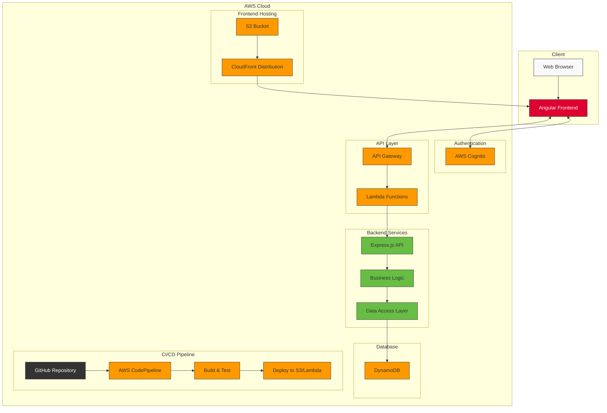

# Overall Architecture Diagram

This diagram illustrates the complete architecture of our Angular and Node.js/Express application deployed on AWS serverless infrastructure. The system is divided into several key areas:

## Client Side
- **Web Browser**: The entry point for users
- **Angular Frontend**: Single-page application built with Angular

## AWS Cloud Infrastructure
- **Frontend Hosting**: 
  - S3 bucket stores static assets
  - CloudFront provides global content delivery with caching

- **Authentication**:
  - AWS Cognito manages user authentication and authorization
  - Handles user registration, login, and token management

- **API Layer**:
  - API Gateway exposes RESTful endpoints
  - Routes requests to appropriate Lambda functions

- **Backend Services**:
  - Lambda Functions execute serverless backend code
  - Express.js provides the API framework
  - Business Logic layer implements application rules
  - Data Access Layer abstracts database operations

- **Database**:
  - DynamoDB provides NoSQL storage with high scalability

- **CI/CD Pipeline**:
  - GitHub Repository stores source code
  - AWS CodePipeline orchestrates the deployment process
  - Build & Test stage validates code quality
  - Deployment stage publishes to S3 and Lambda

This serverless architecture provides high scalability, reduced operational overhead, and pay-per-use cost model.
